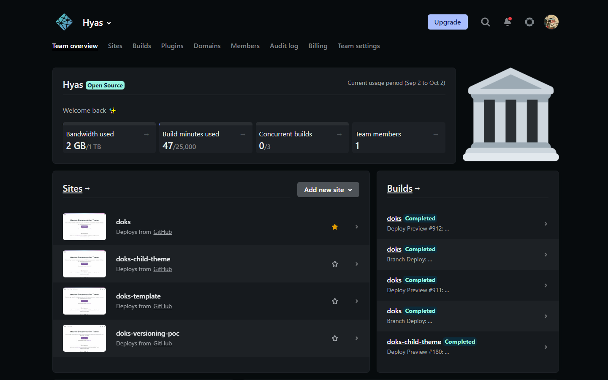

Now there are a few places within the Netlify UI where you can mark a site as a favorite: on the Site overview page for an individual site, within the Sites list table view, and from the Sites list table view on the [Team Overview page](https://docs.netlify.com/accounts-and-billing/team-management/?_ga=2.175447522.1114538312.1663918442-585535340.1663918442#team-overview).

By default, the Sites list table sorts your sites by when they were last updated. The new capability to mark your favorite sites lets you bypass the default sorting method and organize your Sites list table with your most important sites pinned front and center.

After a site has been marked as a favorite, the next time you visit or refresh the Sites list view page, Netlify will move your favorite sites to the top of the list in the order they were last updated.

Note: Your favorite sites are personal to you and won't affect the organization for other members of your team.

<!--

-->

We want to extend a big thank you to all of the developers who requested this feature! We hope it will make it easier for you to keep your sites organized on Netlify.
