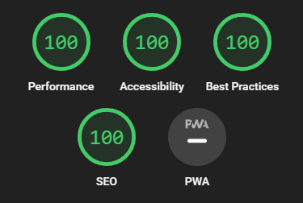

See also Google Lighthouse: [Scan Results for hyas.netlify.app](https://googlechrome.github.io/lighthouse/viewer/?gist=73a46ae67cbe2f70318635b09a548ff0)

## Unused CSS removal

`./config/postcss.config.js`:

```js
const autoprefixer = require('autoprefixer');
const purgecss = require('@fullhuman/postcss-purgecss');
const whitelister = require('purgecss-whitelister');

module.exports = {
  plugins: [
    autoprefixer(),
    purgecss({
      content: [
        './layouts/**/*.html',
        './content/**/*.md',
      ],
      safelist: [
        'lazyloaded',
        'table',
        'thead',
        'tbody',
        'tr',
        'th',
        'td',
        'h3',
        'alert-link',
        ...whitelister([
          './assets/scss/components/_alerts.scss',
          // './assets/scss/components/_buttons.scss',
          './assets/scss/components/_code.scss',
          // './assets/scss/components/_syntax.scss',
        ]),
      ],
    }),
  ],
}
```

See also the PurgeCSS docs: [Configuration](https://purgecss.com/configuration.html), and the Purgecss Whitelister [Readme](https://github.com/qodesmith/purgecss-whitelister#readme).

## Asset minification

Hyas uses [Hugo](https://gohugo.io/hugo-pipes/minification/) to minify CSS, JS and HTML.

## Link prefetching

Hyas uses [Quicklink](https://github.com/GoogleChromeLabs/quicklink) with default settings for link prefetching. By default, Quicklink will automatically prefetch URLs for links that are in-viewport during idle time.

See also the [Quicklink website](https://getquick.link/).

## Lazy loading images

Hyas uses [lazysizes](https://github.com/aFarkas/lazysizes) with a Low Quality Image Placeholder (LQIP) to lazyload [images](/docs/recipes/images/) added with Markdown. The LQIP is blurred with a CSS filter.

See also the lazysizes [Readme](https://github.com/aFarkas/lazysizes#readme)
