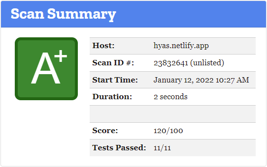

See also Mozilla Observatory: [Scan Results for hyas.netlify.app](https://observatory.mozilla.org/analyze/hyas.netlify.app)

## Netlify

See also the Netlify website: [Security at Netlify](https://www.netlify.com/security/).

### Security Headers

`./layouts/index.headers` excerpt:

```bash
/*
  Strict-Transport-Security: max-age=31536000; includeSubDomains; preload
  X-Content-Type-Options: nosniff
  X-XSS-Protection: 1; mode=block
  Content-Security-Policy: default-src 'self'; manifest-src 'self'; connect-src 'self'; font-src 'self'; img-src 'self' data:; script-src 'self' 'nonce-dXNlcj0iaGVsbG8iLGRvbWFpbj0iaGVua3ZlcmxpbmRlLmNvbSIsZG9jdW1lbnQud3JpdGUodXNlcisiQCIrZG9tYWluKTs=' 'sha256-aWZ3y/RxbBYKHXH0z8+8ljrHG1mSBvyzSfxSMjBSaXk='; style-src 'self'
  X-Frame-Options: SAMEORIGIN
  Referrer-Policy: strict-origin
  Feature-Policy: geolocation 'self'
  Cache-Control: public, max-age=31536000
  Access-Control-Allow-Origin: *
```

See also: [Headers]().

#### Content Security Policy





## Subresource Integrity

[Subresource Integrity](https://developer.mozilla.org/en-US/docs/Web/Security/Subresource_Integrity) is applied to Hyas CSS and JS files when building your Hyas site for production:

- `./layouts/partials/head/stylesheet.html`
- `./layouts/partials/footer/script-footer.html`

See also the Hugo Docs: [Fingerprinting and SRI](https://gohugo.io/hugo-pipes/fingerprint/).

## Hyas Codebase

The Hyas Codebase is regularly checked for vulnarabilites with an automated CodeQL workflow.

See also the GitHub docs: [Finding security vulnerabilities and errors in your code](https://docs.github.com/en/free-pro-team@latest/github/finding-security-vulnerabilities-and-errors-in-your-code)

## Hyas Dependencies

The Hyas Dependencies are regularly checked for updates with an automated Dependabot process.

See also the GitHub docs: [Keeping your dependencies updated automatically](https://docs.github.com/en/free-pro-team@latest/github/administering-a-repository/keeping-your-dependencies-updated-automatically)
